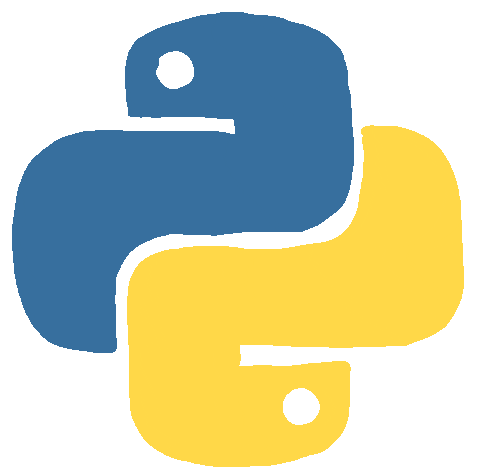
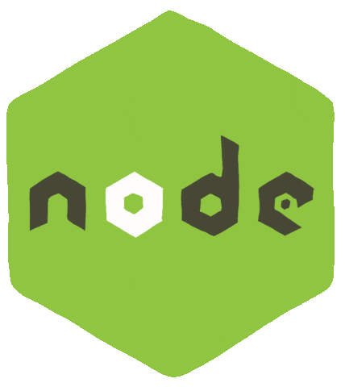
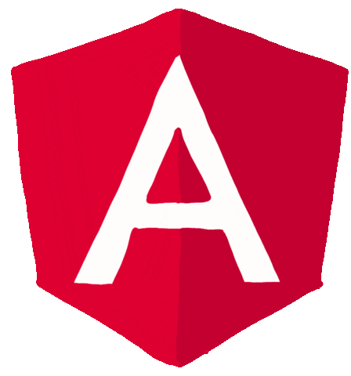
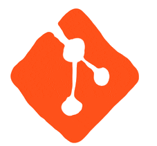

<h1 align="center"><h1/>

<h1 align="center">Hi there, I'm Ouissal MAAROUF  
and i'm </h1>

  

<h4 align="center">I am a Junior developer , studying at ENSAM Casablanca . I like to Code, Innovate and Experiment. I am an enthusiastic and a social person who loves to take up new challenges and learn new skills. I love meeting new people, exchanging ideas and spreading knowledge and positivity.</h4>
 

## 🛠️ Technologies

## My favorite tools and technologies ⚙️

<table align="center">
  <tr>
    <td align="center" width="96">
      
       Java
    </td>
    <td align="center" width="96">
      
       Python
    </td>
    <td align="center" width="96">
      
       PHP
    </td>
    <td align="center" width="96">
      
       C#
    </td>
    <td align="center" width="96">
      
       C++
    </td>
  </tr>
  <tr>
    <td align="center" width="96">
      
       Typescript
    </td>
    <td align="center" width="96">
      
       Javascript
    </td>
    <td align="center" width="96">
      
       Spring
    </td>
    <td align="center" width="96">
      
       Django
    </td>
    <td align="center" width="96">
      
       Node
    </td>
  </tr>
  <tr>
    <td align="center" width="96">
      
       Express
    </td>
    <td align="center" width="96">
      
       Angular
    </td>
    <td align="center" width="96">
      
       React
    </td>
    <td align="center"  width="96">
      
       HTML
    </td>
    <td align="center" width="96">
      
       CSS
    </td>
  </tr>
  <tr>
    <td align="center" width="96">
      
       Bootstrap
    </td>
    <td align="center" width="96">
      
       Tailwind
    </td>
    <td align="center" width="96">
      
       MySQL
    </td>
    <td align="center" width="96">
      
       postgreSQL
    </td>
    <td align="center" width="96">
      
       MongoDB
    </td>
  </tr>
  <tr>
    <td align="center" width="96">
      
       Redis
    </td>
    <td align="center" width="96">
      
       Docker
    </td>
    <td align="center" width="96">
      
       Git
    </td>
    <td align="center" width="96">
      
       Github
    </td>
    <td align="center" width="96">
      
       RabbitMQ
    </td>
  </tr>
  <tr>
   <td align="center" width="96">
      
       Rest API
    </td>
    <td align="center" width="96">
      
       Postman
    </td>
  <td align="center" width="96">
      
       VS Code
    </td>
    <td align="center" width="96">
      
       Unity
    </td>
    <td align="center" width="96">
      
       Blender
    </td>
    </tr>
</table>

## 📊 Github Stats (Expand to View) 

 
  
<b>💻 GitHub Profile Stats</b>

   
  

    
 
  

 
  
<b> 📊 Top languages </b>

   
  

    &nbsp;
    
    
 

 
  
<b>📊 GitHub Stats</b>

   
  

    
  

## 🙋‍♀️ Let's Connect

 	
	
	
	

